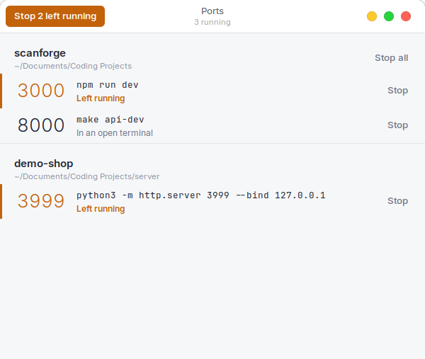
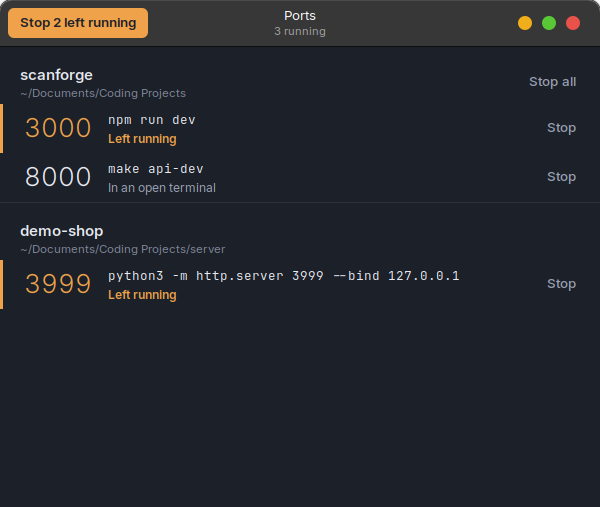

# Ports

Ports is a small Linux desktop app that shows the dev servers and workers still running from your projects. Click Stop to end one. When `localhost:3000` is taken by a project you forgot about, Ports frees it so another project can use the port.

<p>
  
  
</p>

## Requirements

- Linux with GTK 3 and PyGObject (preinstalled on Linux Mint, Ubuntu and most GNOME-based desktops)
- Python 3.10 or newer
- `ss` from iproute2

Nothing to install with pip.

## Install

```bash
git clone https://github.com/Fchery87/ports.git
cd ports
./install.sh
```

`install.sh` adds Ports to your application menu under Development. Run it again if you move the folder. To start Ports without installing, run `./portkill.py`.

## Using it

Each row is one thing you started: a dev server, a worker or a watcher, together with every process it spawned. Rows are grouped by project folder, and a port number at the left shows what the row is listening on.

- **Stop** ends the row's whole process tree. It asks processes to exit, then forces any that are still running after two seconds.
- **Stop all** ends every row in a project.
- **Stop N left running** in the title bar ends everything whose terminal has already closed. These rows are marked in amber.

Each row also has a status:

| Status | Meaning |
|---|---|
| Left running | The terminal that started it is gone |
| In an open terminal | It is still attached to a shell you have open |
| Started by an agent | A coding agent such as Claude Code started it. Shown only if it holds a port |
| Desktop app | A desktop program holding a port. Stop ends that program alone |
| Background service | A systemd user service holding a port. Never included in the bulk stop |

Hover over a port number to see its full address, over the command to see the full command line, and over the status to see every process ID in the row.

## What gets listed

Ports only looks at your own processes. A row appears when either of these holds:

- something in it is listening on a TCP port, or
- it is a dev command (`make`, `npm`, `pnpm`, `node`, `python`, `uvicorn`, `cargo` and similar) running inside a project folder under your home directory.

A project folder is the nearest directory with a `.git`. Without one, it's the outermost directory containing a marker file such as `package.json`, `pyproject.toml` or `Makefile`.

Shells, coding agents and their helper servers, and desktop programs without a port stay off the list. Then a Stop can't close your terminal or your editor.

## Dark mode

Ports follows the system dark mode setting (System Settings → Themes on Linux Mint) and switches live. When dark mode is on, Ports uses your theme's dark version, for example WhiteSur-Dark for WhiteSur-Light, so the title bar matches the list. It never changes your system theme.

## Limitations

- Docker containers aren't listed. Their ports belong to a root-owned Docker process, so stop them with `docker compose stop`.
- A dev process outside your home directory (for example in `/tmp`) is listed only if it holds a port.
- A worker with no port that you start through a bare `bash -c '...'` wrapper isn't listed. Starting it with `make`, `npm` or the runtime directly works.

## Development

```bash
python3 -m unittest -v
```

The rules that decide what gets listed and what Stop ends are pure functions in `portkill.py`. The tests run them against process tables modelled on a real machine, so they need no desktop session.
